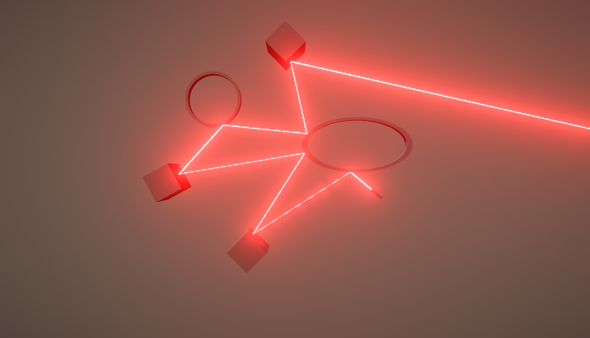

# LaserExample

Example project on how to make laser with raycasting   

# Features
- Toggle for debug line
- Toggle for draw laser
- Maximum Iterations
- Raycast distance
- Spawn lights toggle

# Bugs, limitations, todos
- LineRenderer is not the best way for rendering laser, alternative could be trail renderer
